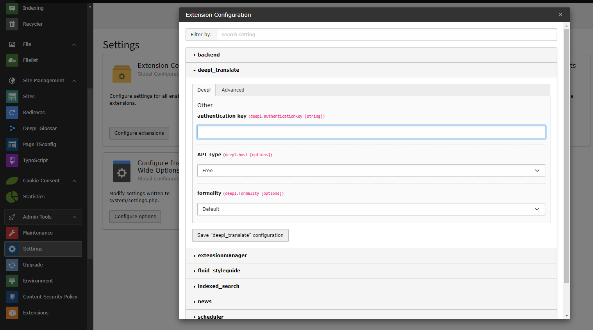
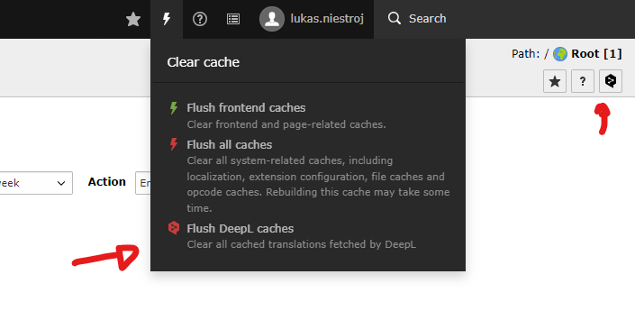
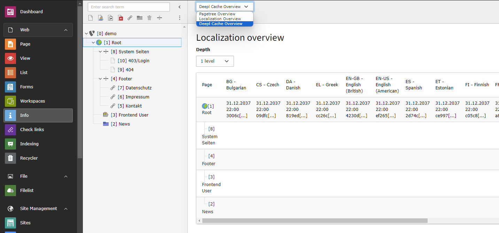

# Installation

``composer require werkraum/deepl-translate-slim``

## Extension Setup

You have to provide an ``authenticationKey``. Make sure to set the API Type to *pro* if you have a pro account.



### Global Configuration Values

| Key                | Description                                                                                                                                                    |
|--------------------|----------------------------------------------------------------------------------------------------------------------------------------------------------------|
| authenticationKey  | The authentication Key for the DeepL Api [Deepl API Key](https://support.deepl.com/hc/en-us/articles/360020695820-API-Key-for-DeepL-s-API)                     |
| host               | The API Type. Free and Pro have different Endpoints.  [Free and Pro](https://support.deepl.com/hc/en-us/articles/360021183620-DeepL-API-Free-vs-DeepL-API-Pro) |
| formality          | See [Deepl API Reference](https://developers.deepl.com/docs/api-reference/translate/openapi-spec-for-text-translation)                                         |
| ignoreTags         | See [Deepl API Reference](https://developers.deepl.com/docs/api-reference/translate/openapi-spec-for-text-translation)                                         |
| splitSentences     | See [Deepl API Reference](https://developers.deepl.com/docs/api-reference/translate/openapi-spec-for-text-translation)                                         |
| preserveFormatting | See [Deepl API Reference](https://developers.deepl.com/docs/api-reference/translate/openapi-spec-for-text-translation)                                         |
| nonSplittingTags   | See [Deepl API Reference](https://developers.deepl.com/docs/api-reference/translate/openapi-spec-for-text-translation)                                         |
| outlineDetection   | See [Deepl API Reference](https://developers.deepl.com/docs/api-reference/translate/openapi-spec-for-text-translation)                                         |
| splittingTags      | See [Deepl API Reference](https://developers.deepl.com/docs/api-reference/translate/openapi-spec-for-text-translation)                                         |
| clearCache         | See [Caching](#Caching)                                                                                                                                        |

## Site Configuration Values

| Name                                             | Key                                   | Description                                                                                                                                                                                                                                                 |
|--------------------------------------------------|---------------------------------------|-------------------------------------------------------------------------------------------------------------------------------------------------------------------------------------------------------------------------------------------------------------|
| (default/fallback) Source Language               | default_deepl_source_language         | The source language DeepL will use to translate from. Can be disabled for each language. See languages.                                                                                                                                                     |
| (default/fallback) Allowed targets               | default_deepl_allowed_languages       | Add all allowed languages as alternate links. (clear the page cache to make this change take effect!)                                                                                                                                                       |
| Hreflang                                         | deepl_hreflang                        | Only this languages will be offered for translation. Can be changed for each language. See languages.                                                                                                                                                       |
| Exclude Elements                                 | deepl_exclude_elements_by_selector    | Exclude HTML elements from translation by CSS3 Selector (comma-separated!)                                                                                                                                                                                  |
| Split content                                    | deepl_split_content_by_selectors      | DeepL has a content-length limit per translation request so we need to split our html into parts. Specify parts of your HTML by a comma-separated list of CSS3 selectors which can be translated separately. e.g. "#page-header,#page-content,#page-footer" |
| Replace links                                    | deepl_replace_links                   | Add the language param "deepl" to all links?                                                                                                                                                                                                                |
| Skip links                                       | deepl_replace_links_attribute         | Yes/No                                                                                                                                                                                                                                                      |
| Translated by machine placeholder                | deepl_translated_by_machine           | You have the following placeholder: {source}, {target}, {originalLink}                                                                                                                                                                                      |
| Target for the Translated by machine placeholder | deepl_translated_by_machine_target    | Please specify an html element with an ID                                                                                                                                                                                                                   |
| Translate the Translated by machine placeholder  | deepl_translate_translated_by_machine | Yes/No                                                                                                                                                                                                                                                      |
| Recaptcha Protection                             | deepl_recaptcha                       | Enable recaptcha verification to allow access to translated content.                                                                                                                                                                                        |
| Recaptcha Verify Page                            | deepl_recaptcha_redirect_to_page      | PAge to redirect the user to verify their access via recaptcha. The configured page has to display the recaptcha verify plugin.                                                                                                                             |

## Menu Integration

The extension has a custom `\Werkraum\DeeplTranslate\DataProcessing\DeepLMenuProcessor` to provide the enabled DeepL translation targets. It provides the same values as the `\TYPO3\CMS\Frontend\DataProcessing\LanguageMenuProcessor`

```typo3_typoscript
dataProcessing {
  10 = Werkraum\DeeplTranslate\DataProcessing\DeepLMenuProcessor
  10 {
    as = menu
  }
}
```

```html
<html data-namespace-typo3-fluid="true"
      xmlns:f="http://typo3.org/ns/TYPO3/Fluid/ViewHelpers"
>
<nav class="nav languagenav text-uppercase notranslate">
    <f:for each="{menu}" as="item" iteration="iter">
        <a class="nav-link" href="{item.link}" hreflang="{item.hreflang}" title="{item.title}">
            <span>{item.title}</span>
        </a>
    </f:for>
</nav>
</html>
```

## Caching

The extension has its own cache to ensure that translations are retained in the system even if the content of the pages changes. The service is not free of charge and should be used sparingly. Nevertheless, this cache can be checked and emptied:



You can enable ``cacheClear`` in the extension configuration to always flush the translations on page or page content change. By default it is disabled.

A dedicated view in the InfoModule provides a detailed overview of all cached pages.



## Custom Translation Processing

You can customize and extend the translation process by implementing a custom DocumentProcessor with the Interface ``\Werkraum\DeeplTranslate\DocumentProcessor\DocumentProcessorInterface``.

Look into [ReplaceLinksProcessor.php](Classes/DocumentProcessor/Processor/ReplaceLinksProcessor.php) to see it in action.
